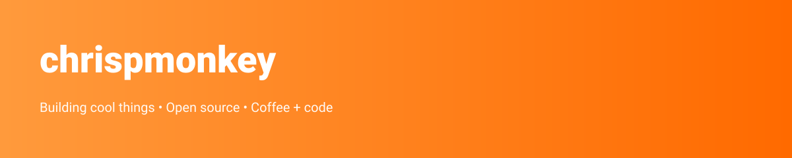

  

<h1 align="center">Hi 👋, I'm chrispmonkey</h1>

Building cool things • Open source • Coffee + code

  
  

  
  

  

  

  

  

## 🔭 Featured Projects
- [Your-repo](https://github.com/chrispmonkey/your-repo) — Replace with your project

## 🧰 Tech & Tools
<code>TypeScript</code> <code>React</code> <code>Node.js</code> <code>Docker</code>

## 📫 Connect
- GitHub: https://github.com/chrispmonkey
- Twitter: [@yourhandle](https://twitter.com/yourhandle)  <!-- Replace with your handle -->
- Website: https://yourwebsite.com  <!-- Replace with your website -->

  

<!--
  Notes for you:
  - Replace placeholders (Twitter, Website) with real links.
  - To personalize further: add WakaTime, Spotify widgets, custom GIFs in assets/, or enable pinned repos on your profile.
  - To change banner, replace assets/banner.svg with a custom image (GIFs and PNGs work too).  Drag-and-drop to this repo or push via gh cli.
-->
